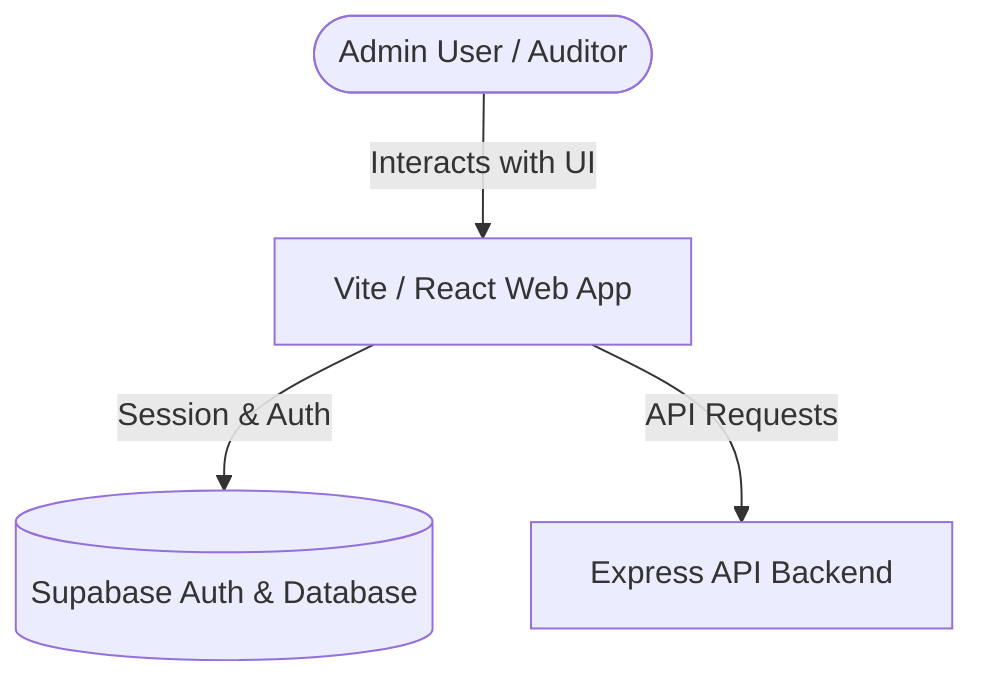

# CraftMatch Verification Portal Documentation

This repository contains the verification and administration portal frontend for the CraftMatch platform. It is a React Single Page Application (SPA) built using Vite, TypeScript, and TailwindCSS.

---

## 1. Architecture Overview

### System Architecture
The verification portal acts as the administration surface of the platform, communicating directly with two backends:
1. **Supabase Client SDK**: Handles user authentication session tracking and direct database queries.
2. **Express API Backend**: Custom endpoints for managing workflows, service catalog updates, audit logs, and notification dispatches.



### Directory Structure
- **[src/components/](file:///c:/Users/user/Downloads/FinalYearProject/CraftMatch_Verification_Portal/src/components)**: Reusable UI layout elements, cards, and modal sheets.
- **[src/pages/](file:///c:/Users/user/Downloads/FinalYearProject/CraftMatch_Verification_Portal/src/pages)**: Public views (`ApplyPage`, `StatusPage`, `LandingPage`).
- **[src/pages/admin/](file:///c:/Users/user/Downloads/FinalYearProject/CraftMatch_Verification_Portal/src/pages/admin)**: Admin-only dashboard interfaces:
  - **`AdminDashboard.tsx`**: Central analytics metrics, summary stats.
  - **`ApplicationsTable.tsx` / `ApplicationDetail.tsx`**: Artisan application processing queue.
  - **`AccountsPage.tsx`**: Suspension and activation controls for client/worker accounts.
  - **`ServiceCatalogPage.tsx`**: Pricing and category configuration panel.
  - **`AuditLogPage.tsx`**: Audit log review table.
- **[src/lib/](file:///c:/Users/user/Downloads/FinalYearProject/CraftMatch_Verification_Portal/src/lib)**: Shared client instances, config files, and helper modules ([supabase.ts](file:///c:/Users/user/Downloads/FinalYearProject/CraftMatch_Verification_Portal/src/lib/supabase.ts), [api.ts](file:///c:/Users/user/Downloads/FinalYearProject/CraftMatch_Verification_Portal/src/lib/api.ts)).

---

## 2. Getting Started & Development

### Prerequisites
Ensure Node.js `>=20.0.0` is installed.

### Installation
1. Navigate to the project directory:
   ```bash
   cd CraftMatch_Verification_Portal
   ```
2. Install npm dependencies:
   ```bash
   npm install
   ```
3. Set up environment variables by copying `.env.example` to `.env`:
   ```bash
   cp .env.example .env
   ```
   Modify the values in `.env` to match your local development environment:
   - `VITE_SUPABASE_URL`
   - `VITE_SUPABASE_ANON_KEY`
   - `VITE_BACKEND_API_URL`

### Development Scripts
The following npm commands are configured in [package.json](file:///c:/Users/user/Downloads/FinalYearProject/CraftMatch_Verification_Portal/package.json):

* **Run Locally**: `npm run dev` (Runs the development server on `http://localhost:5173/`).
* **Linting**: `npm run lint` (Statically analyzes files using ESLint).
* **Type Checking**: `npm run typecheck` (Checks TypeScript compilation).
* **Production Build**: `npm run build` (Compiles and bundles optimization code under `dist/`).
* **Preview Bundle**: `npm run preview` (Launches a local preview server for the compiled bundle).
