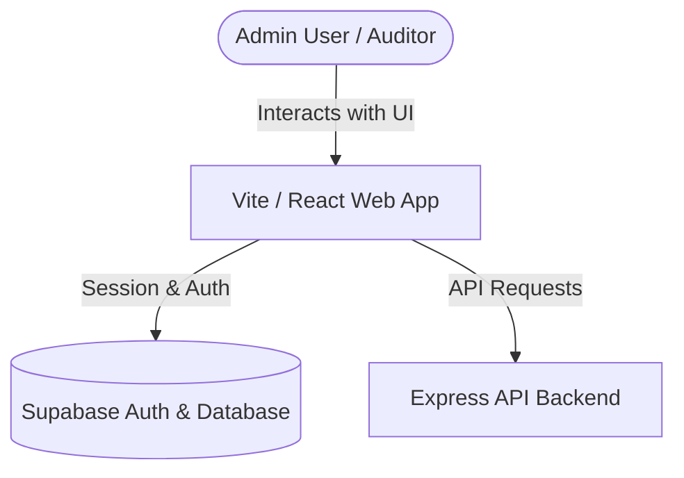

# Architecture Overview

This document describes the runtime architecture, components, and directory design of the **CraftMatch Verification Portal** application.

## System Architecture

The verification portal is a client-side Single Page Application (SPA) communicating directly with two backends:
1. **Supabase Client SDK**: Handles user authentication session tracking and direct real-time database queries where appropriate.
2. **Express API Backend**: Custom endpoints for managing workflows, service catalog updates, audit logs, and notification dispatches.

## Directory Design

- **[src/components/](file:///c:/Users/user/Downloads/FinalYearProject/CraftMatch_Verification_Portal/src/components)**: Reusable UI layout elements, cards, and modal sheets.
- **[src/pages/](file:///c:/Users/user/Downloads/FinalYearProject/CraftMatch_Verification_Portal/src/pages)**: Public views (`ApplyPage`, `StatusPage`, `LandingPage`).
- **[src/pages/admin/](file:///c:/Users/user/Downloads/FinalYearProject/CraftMatch_Verification_Portal/src/pages/admin)**: Admin-only dashboard interfaces:
  - **`AdminDashboard.tsx`**: Central analytics metrics, summary stats.
  - **`ApplicationsTable.tsx` / `ApplicationDetail.tsx`**: Artisan application processing queue.
  - **`AccountsPage.tsx`**: Suspension and activation controls for client/worker accounts.
  - **`ServiceCatalogPage.tsx`**: Pricing and category configuration panel.
  - **`AuditLogPage.tsx`**: Audit log review table.
- **[src/lib/](file:///c:/Users/user/Downloads/FinalYearProject/CraftMatch_Verification_Portal/src/lib)**: Shared client instances, config files, and helper modules ([supabase.ts](file:///c:/Users/user/Downloads/FinalYearProject/CraftMatch_Verification_Portal/src/lib/supabase.ts), [api.ts](file:///c:/Users/user/Downloads/FinalYearProject/CraftMatch_Verification_Portal/src/lib/api.ts)).
